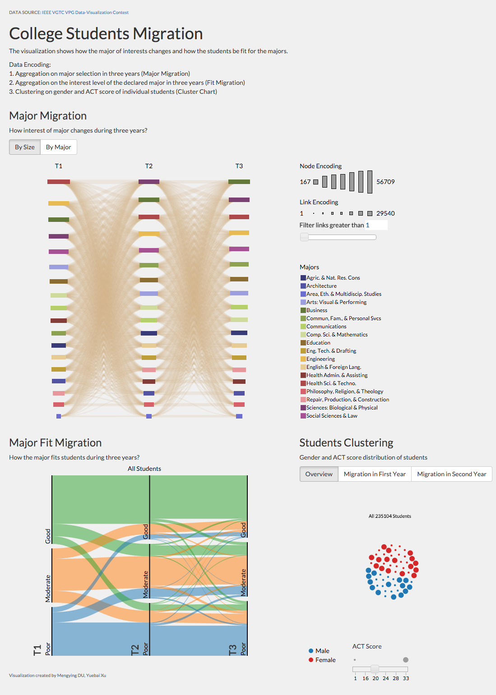

##Infovis Project - College Students Migration

###Data Source
Contest Challenge: Perceived vs. Actual Student Interest
<http://vacommunity.org/ieeevpg/viscontest/2015/>

Data Attributes

<http://vacommunity.org/ieeevpg/viscontest/2015//student_flow_aggregated_field_descriptions.pdf#page=3>

###Entire Layout

###Description
This visualization shows how the major of interests changes and how the students be fit for different majors.

It consists of three charts:
 
1. Major Migration Chart: aggregation on major selection in three years (**T1_Level2,T2_Level2,T3_Level2**)
2. Fit Chart: aggregation on the interest level of the declared major in three years (**T1_IMFIT,T2_IMFIT,T3_IMFIT**)
3. Cluster Chart: clustering and aggragation on gender and ACT score of individual student (**Gender,Actcat**)

##Interaction
####Major Migration Chart:

1. Hover the node(rectangle) to check the number of certain declared major in certain year, also the number of flow-in and flow-out from different majors in previous year and following year.

2. Click on the rectangle to see the detailed selected group student with a best fit major distribution(figure below). If you want to go back, just clicking on the blank canvas in the graph

3. The **Fit Chart** and **Cluster Chart** will be updated dynamically as filtering the selection in **Major Migration Chart**.

4. You can use slider on the side to filter the least number of links(student transfer from one year to next)

5. Hover on the legend to check number of students rankings through three years

####Cluster Chart:

1. Toggle button to see the migration status,for example to check how many students change their major between two years(T1!=T2).

2. Slide on the ACT score slider to re-clustering the data based on their ACT scores.

####D3 layouts used
1. Sankey Graph <http://bost.ocks.org/mike/sankey/> 
2. Parsets <https://github.com/jasondavies/d3-parsets>
3. Clustor Force Layout <http://bl.ocks.org/mbostock/7882658>

